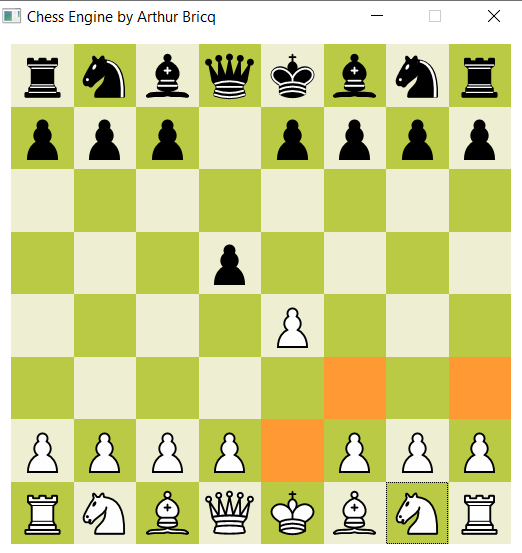

# ♔ Chess Engine in Rust ♚

This repo contains the code of a **chess engine** fully written in Rust, from scratch. 

This is one of my many personal projects in Rust. And it is my second chess engine (*I had done the first in [C++](https://github.com/arthurBricq/chess_cpp)*)

This engine runs at about 10 million moves per seconds on my machine.



The engine features :

- Tree-search for the best move (min-max algorithm). The resulting computing speed is about 500'000 moves / second.
  - Alpha Beta pruning to do it faster
  - Transposition table to avoid double computation
  - Extra depth for captures move
- Evaluation function that favors attacking positions
- An extremely light-weight chess representation
- UI to play locally on your computer


The whole idea behind this chess engine is that the representation of a chess game is very small: it's **only** 7 integers !

```rust
pub struct ChessGame {
  whites: u64,
  pawns: u64,
  bishops: u64,
  knights: u64,
  rooks: u64,
  queens: u64,
  kings: u64,
  flags: u64
}
```

This was a design decision, that has benefits and drawbacks. 
- Drawbacks: it's a bit hard to represent moves, captures, ...
- Benefits: It's super quick to copy a game, therefore the solver can just create massive amounts of games instead of 
  having to work with a single game.

This code contains the following part:
- The **representation of a chess game** (position of pieces, rules to determine if moves are valid), under `model/game.rs` and `model/moves.rs`. This part is really the most difficult part.
- The **chess engine**. Basically, it's a recursive function that explores the **tree of possible moves** until a given depth. The tree-serach algorithm is a **min-max** search with **alpha-beta prunning**. The engine is located under `model/engine.rs`
- To play with this engine, I have developed a **UI** very easy to deploy with FTLK.rs. There is also a WebApp (because i wanted to try `yew.rs`) in the eventual possibility to host this engine on my website...

## Quick Start

The only required dependency is Rust with cargo.

Feel free to try it out and let me know !

```bash
git clone <...>
cd chess_rust
cargo run --bin chess --release
```

The flag `--release` tells rust to optimize the code (this is absolutely required), and `--features fltk` specify that you want to compile the UI and to run with the UI. 

## Why a chess engine to learn Rust ? 

Programming a chess engine is a brilliant exercise for an accomplished developer. I think that chess programming is really the perfect project for testing your own skills. 
- It is **easy enough** to not take too long: it can be done in a few weeks / months, which is good for self-projects. I often have the problem to start projects too long and I end up tired of them.
- It is **difficult enough** to really challenge you. There are some things that are really not trivial. Encoding the rule of chess in a way to allows to have a depth of search good enough is really not easy.

## [Dev] TODO List for myself

List of missing features

  - [ ] En Passant, using a stateful representation
  - [ ] Fix bugs with castling: it seems possible to long castle if there is a piece in between the king and the rook
  - [ ] Non-queen promotions

### How to optimise the score function ? 

- solver calls game.getAllMoves --> we know the size here.
- for each move, create a new game 
- for each new game, call the solver : if finished, call game.score()

==> for a given game, game.score() is always called before game.getAllMoves ... 

## Benchmarking result

The command `cargo run` without any features will run the benchmarking test.


